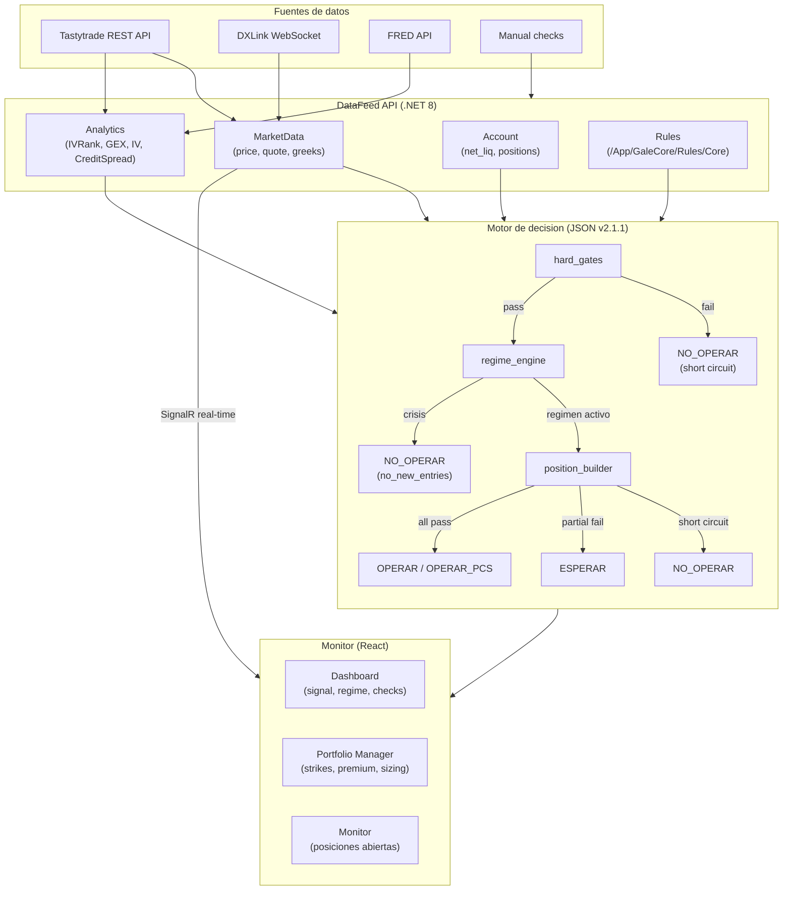
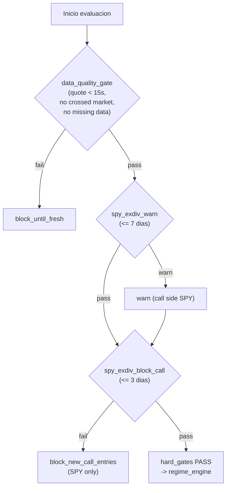
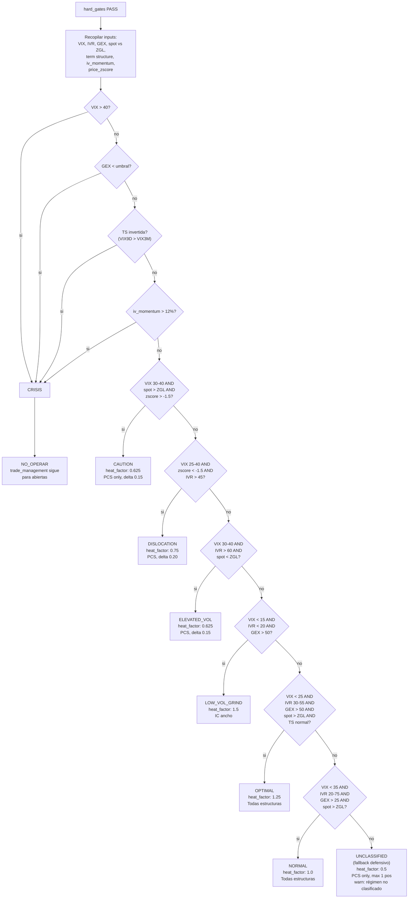
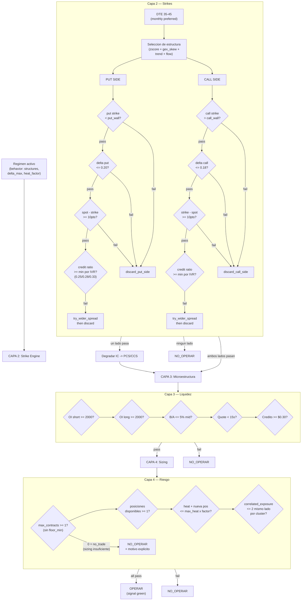
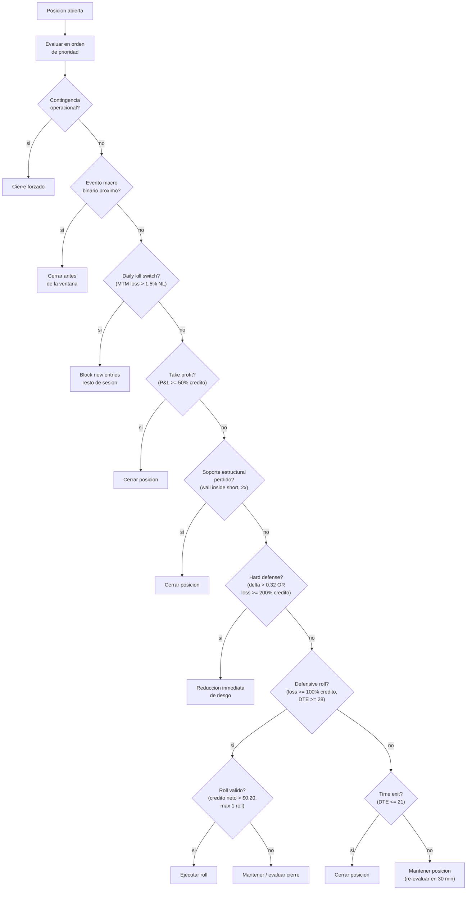
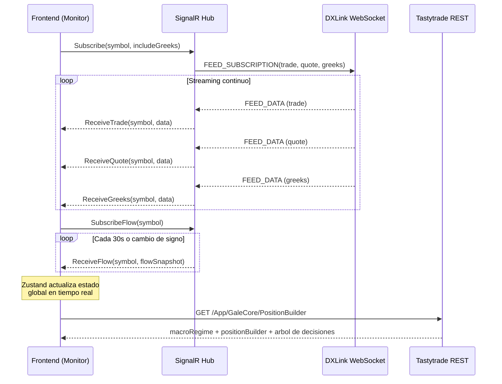

# GaleCore — Flujo E2E v2.1.3

## Flujo principal: de datos a senal

## Detalle: hard_gates

## Detalle: regime_engine

## Detalle: position_builder (capas 2-4)

## Detalle: trade_management (posiciones abiertas)

## Flujo de datos real-time (SignalR)

